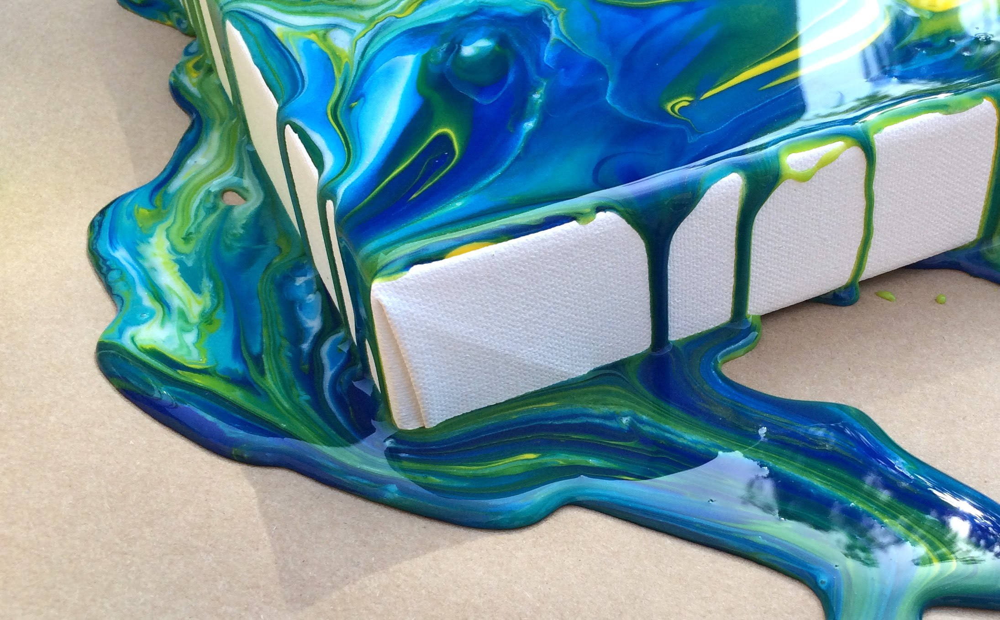
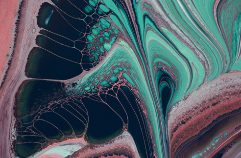

&nbsp;

&nbsp;

# Muhammad Umar Butt

&nbsp;

  

&nbsp;

_'When we look at things, we don't experience the world as a meaningless jumble of lines, colours or motions. Instead, whenever we open our eyes, we immediately gain access to a richly detailed world of meaningful visual sensations' - Fleming (2017)_

&nbsp;

I am a postgraduate student in the University of Glasgow's [Institute of Neuroscience and Psychology](http://www.gla.ac.uk/researchinstitutes/neurosciencepsychology/) department, working with [Dr David Simmons.](https://www.gla.ac.uk/schools/psychology/staff/davidsimmons/)

My current [Research](http://rstudio1.psy.gla.ac.uk:8787/files/mywebpage/docs/Research_Background.html) interest lies within 
the investigation of material perception and how judgements of visual aesthetics i.e liquids elicit an 

emotional response.

&nbsp;

About me: [Personal](http://rstudio1.psy.gla.ac.uk:8787/files/mywebpage/docs/Personal.html)

Sources where you can find me: [Glasgow Research](http://www.psy.gla.ac.uk/staff/?id=MUB01)

Link to my code: [GitHub](https://github.com/umarbutt92/mywebpage)